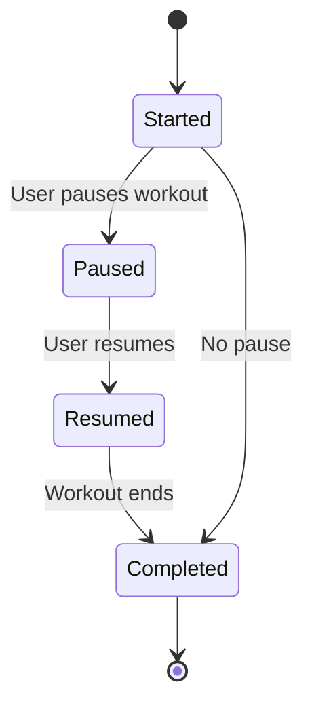

markdown
### State Diagram – ActivitySession

```mermaid
stateDiagram-v2
    [*] --> Started
    Started --> Paused: User pauses workout
    Paused --> Resumed: User resumes
    Resumed --> Completed: Workout ends
    Started --> Completed: No pause
    Completed --> [*]
```
Explanation:
	•	FR Reference: FR3 – Real-time Monitoring
	•	User Story: US-001 – “Track steps, heart rate, calories”

---
