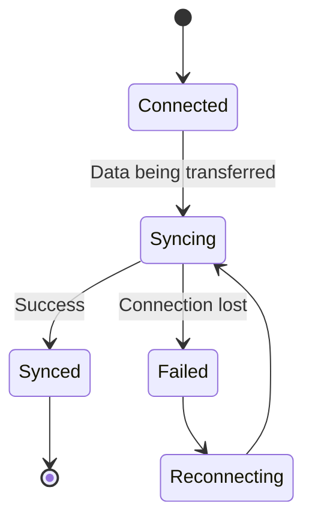

markdown
### State Diagram – DeviceSync

```mermaid
stateDiagram-v2
    [*] --> Connected
    Connected --> Syncing: Data being transferred
    Syncing --> Synced: Success
    Syncing --> Failed: Connection lost
    Failed --> Reconnecting
    Reconnecting --> Syncing
    Synced --> [*]
```
Explanation:
	•	FR Reference: FR4 – Device Integration
	•	Use Case: Sync Device Data

---

