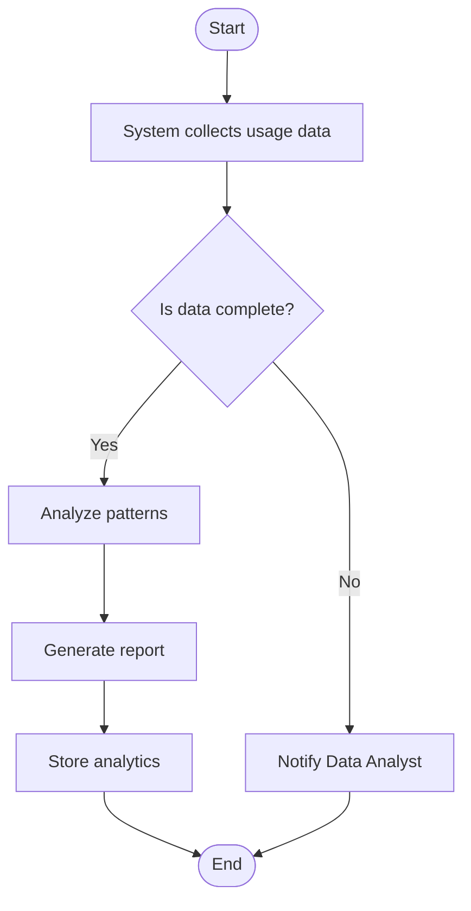

markdown
### Activity Diagram – Generate Fitness Analytics

```mermaid
flowchart TD
    A([Start]) --> B[System collects usage data]
    B --> C{Is data complete?}
    C -- Yes --> D[Analyze patterns]
    D --> E[Generate report]
    E --> F[Store analytics]
    C -- No --> G[Notify Data Analyst]
    F --> H([End])
    G --> H
```
Explanation:
	•	FR Reference: FR5 – Fitness Analytics
	•	Use Case: Generate Fitness Analytics

---
