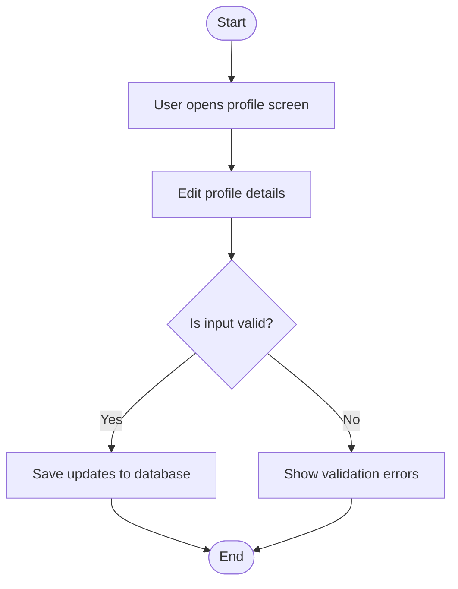

markdown
### Activity Diagram – Manage Profile

```mermaid
flowchart TD
    A([Start]) --> B[User opens profile screen]
    B --> C[Edit profile details]
    C --> D{Is input valid?}
    D -- Yes --> E[Save updates to database]
    D -- No --> F[Show validation errors]
    E --> G([End])
    F --> G
```
Explanation:
	•	FR Reference: FR2 – Profile Management
	•	Use Case: Manage Profile

---
