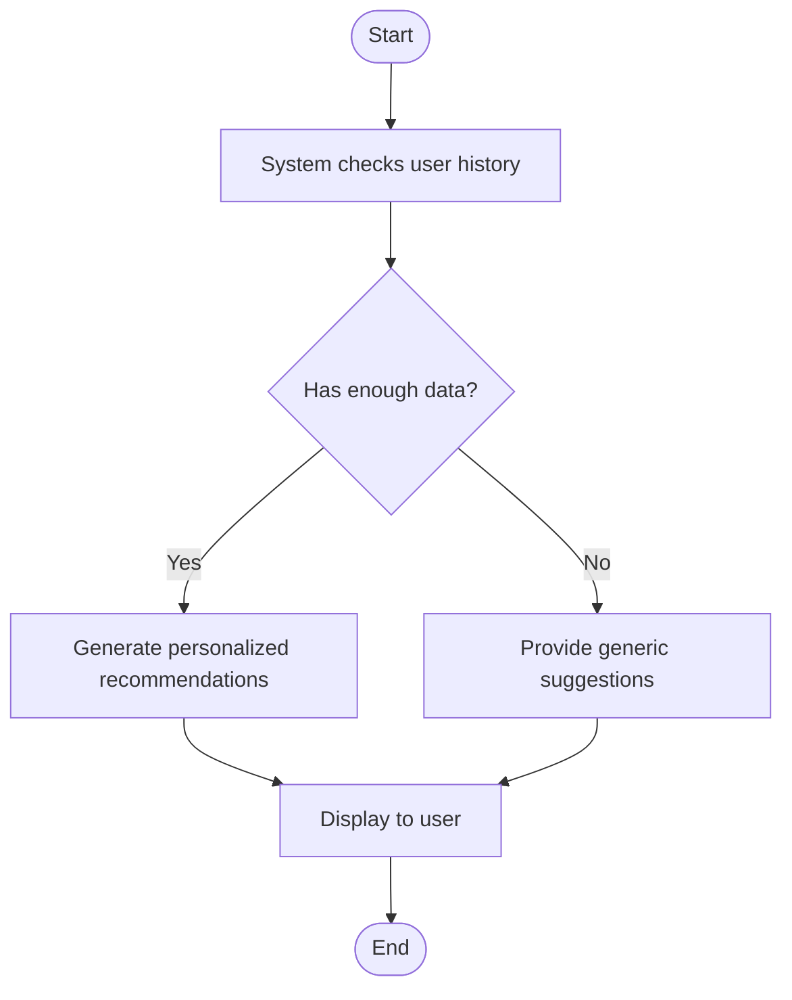

markdown
### Activity Diagram – Receive Personalized Recommendations

Explanation:
	•	FR Reference: FR6 – Personalized Recommendations
	•	User Story: US-002
	•	Use Case: Receive Personalized Recommendations

---
