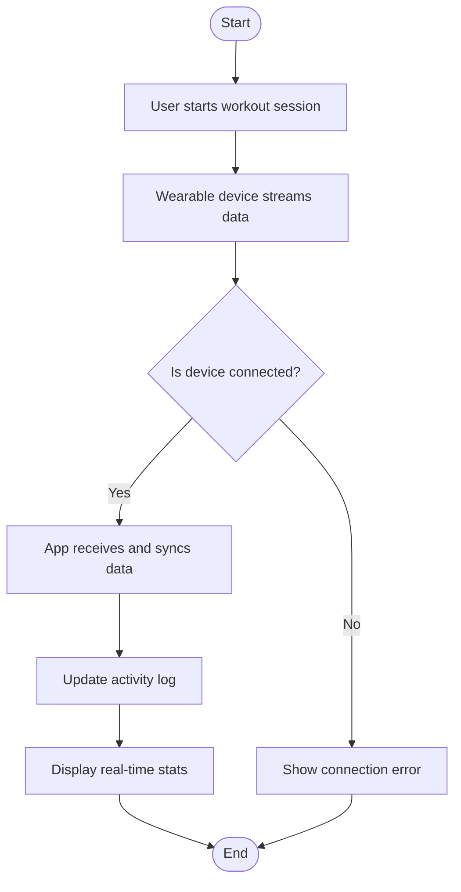

markdown
### Activity Diagram – Track Real-Time Activity

```mermaid
flowchart TD
    A([Start]) --> B[User starts workout session]
    B --> C[Wearable device streams data]
    C --> D{Is device connected?}
    D -- Yes --> E[App receives and syncs data]
    E --> F[Update activity log]
    F --> G[Display real-time stats]
    G --> H([End])
    D -- No --> I[Show connection error]
    I --> H
```
Explanation:
	•	FR Reference: FR3 – Real-time Monitoring
	•	User Story: US-001
	•	Use Case: Track Real-Time Activity

---
