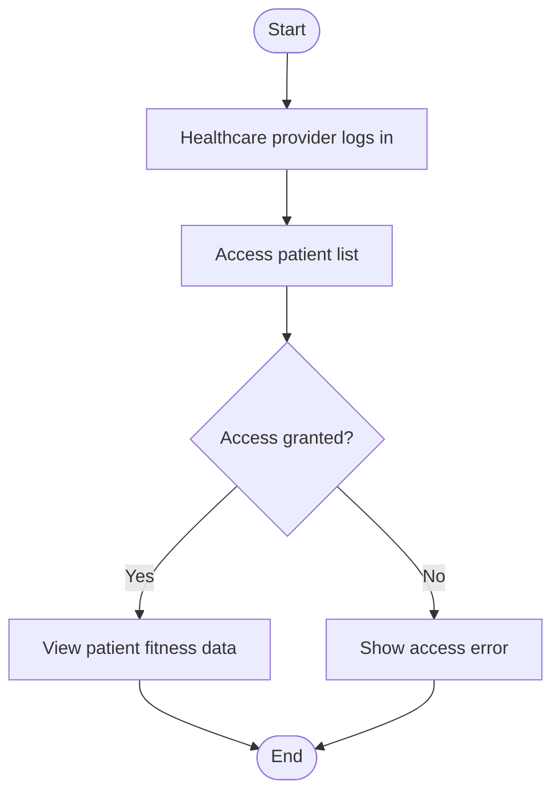

markdown
### Activity Diagram – View Patient Progress

```mermaid
flowchart TD
    A([Start]) --> B[Healthcare provider logs in]
    B --> C[Access patient list]
    C --> D{Access granted?}
    D -- Yes --> E[View patient fitness data]
    D -- No --> F[Show access error]
    E --> G([End])
    F --> G
```
Explanation:
	•	FR Reference: FR8
	•	Use Case: View Patient Progress (for external actors)

---
